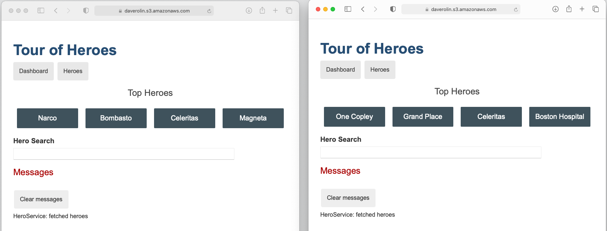

# Suffolk-toh
Angular has a Tour of Heroes tutorial which goes through the development of a prototypical app.  Here is a link to the tutorial: https://angular.io/tutorial.  At Suffolk, we construct buildings so we’ve made a couple of changes.  Specifically, we went to the last part of the tutorial(https://angular.io/tutorial/toh-pt6), downloaded the files for the finished project (https://angular.io/generated/zips/toh-pt6/toh-pt6.zip), and put them in this repository as the initial commit.  We then updated 2 files to move from hero names to building names and to add sample cost and area data.  Here are the specifics:

1. **src/app/hero.ts:** added 2 new fields to the Hero type, cost and area (both are numbers and represent the cost in dollars and the area in square feet)
2. **src/app/in-memory-data.service.ts:** changed names from hero names to building names.  Added cost and area info for the buildings.

Here's the original vanilla version of the tutorial (left) and our slightly changed version (right):

You can also view them side by side yourselft by going to https://daverolin.s3.amazonaws.com/Vanilla-toh/index.html and https://daverolin.s3.amazonaws.com/Suffolk-toh/index.html. We immediately liked the changes but we’d like to take it further and we’d like some help.  Here’s what we have in mind:

1. The app currently has no Suffolk branding and we haven’t changed the UI at all to show the additional data of cost and area.  Please update the app to reflect Suffolk branding.  Also, please change the list view (which comes up when you click the Heroes button) to display cost along with building name.
2. The dashboard currently displays by position in the list.  Our users care deeply about cost and cost per square foot.  Please change it so the dashboard shows the top 4 buildings by cost, and add a the total cost as well as the cost/square foot to the four buildings displayed.

We're looking to build out our team, and we designed this exercise to see what it would be like to work together.  The market size of the U.S. construction sector exceeds 1 trillion dolllars per year, and Suffolk is one of the most succesfull companies in the industry. This is a market ripe for digital disruption and we're a team that's passionate about building great products to lead the disruption.  If this sounds interesting, then please clone the repo, make your changes on a branch, and submit a pull request when you're ready for us to look at them. If you don't have curently have Angular installed, here's a link to get started https://angular.io/guide/setup-local.  We value team work at Suffolk, so please reach out if you have any questions.  We welcome feedback about the structure of this exercise too. Your best bet is to email any questions and feedback you have to Dave, Michael, and Kian (drolin@suffolk.com, mcarr@suffolk.com, kkenahan@suffolk.com).  

You have the code, you have the target, let’s see what we can build together!  Good luck!
